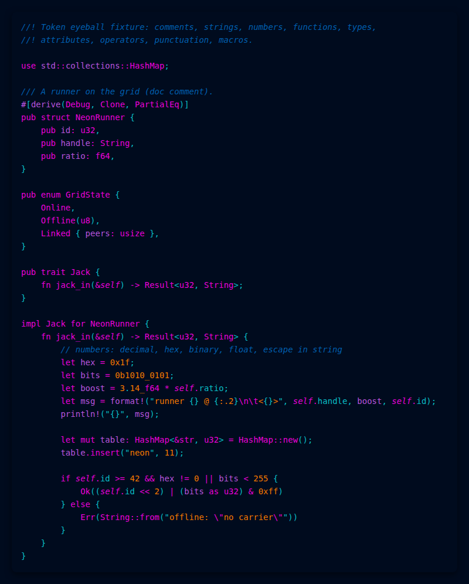
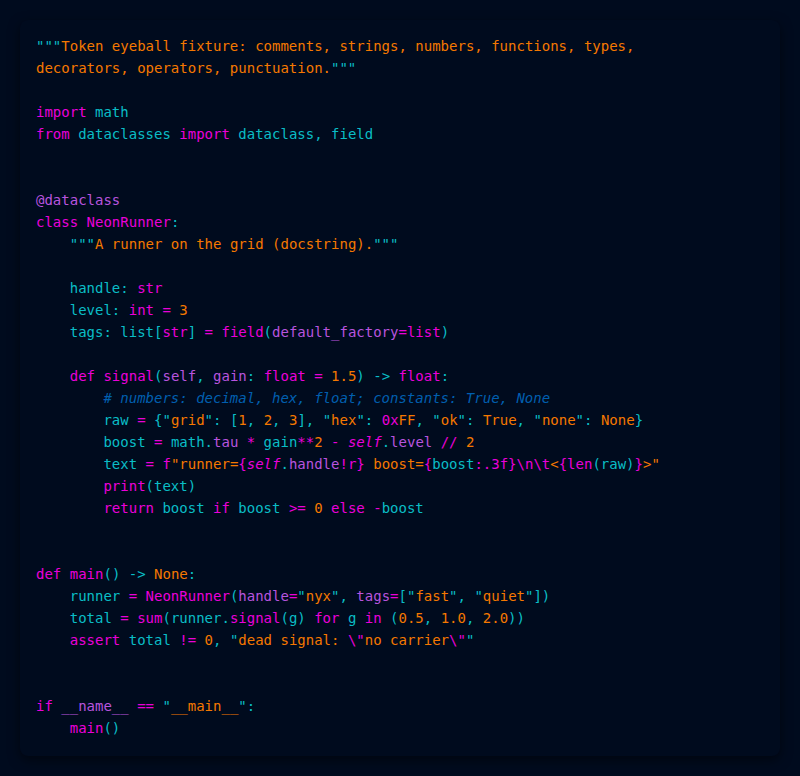

# Cyberpunk Neon for VS Code




A dark cyberpunk color theme: neon cyan (`#0abdc6`) on deep blue (`#000b1e`),
magenta keywords, orange strings. A faithful port of
[Roboron3042's Cyberpunk-Neon](https://github.com/Roboron3042/Cyberpunk-Neon)
palette, sharing its role→color decisions with the
[Zed port](https://github.com/FooBarbarian-dev/cyberpunk-neon-zed) so both
editors match.

## Install

**From the Marketplace** (once published): search for "Cyberpunk Neon" in the
Extensions view (`Ctrl+Shift+X`), install, then pick **Cyberpunk Neon** via
`Preferences: Color Theme` (`Ctrl+K Ctrl+T`).

> The manifest currently ships the placeholder publisher `FooBarbarian-dev`;
> create/claim a real publisher ID with `vsce` before an actual Marketplace
> release.

**From a `.vsix`**:

```sh
npx @vscode/vsce package --no-dependencies
code --install-extension cyberpunk-neon-0.1.0.vsix
```

## Transparency: GlassIt owns it, not the theme

This theme is fully opaque on purpose. Window transparency is applied
externally with [GlassIt](https://github.com/hail2u/GlassIt-VSC)
(or your compositor), which sets opacity at the **window** level — it fades
glyphs and backgrounds alike, so theme-side surface alpha would buy nothing.
The theme's contribution to that setup is contrast headroom: every token color
clears 4.5:1 against the editor background (comments 3.0:1), so text survives
being dimmed.

Do **not** darken this theme to compensate for transparency — that dims
exactly as much as it "fixes". The opacity level itself is a user preference
in GlassIt, not a theme setting.

## Markdown

The built-in markdown preview is fully themed: headings, links, blockquotes,
inline code, code blocks, and rules all use this theme's palette, and fenced
code blocks in the preview are highlighted with the editor's token colors.

**Mermaid diagrams** in the preview require the
[bierner.markdown-mermaid](https://marketplace.visualstudio.com/items?itemName=bierner.markdown-mermaid)
extension, and the diagram strokes/fills come mostly from mermaid's own dark
theme rather than from this theme. In the raw buffer, mermaid blocks (arrows,
pipes, markers) are colored by this theme like any fenced code.

## Verifying a build

```sh
python3 -c "import json; json.load(open('themes/cyberpunk-neon-color-theme.json'))"
python3 scripts/check_theme.py themes/cyberpunk-neon-color-theme.json
python3 scripts/check_theme.py --selftest
```

The checker validates every workbench key against the official
[Theme Color reference](https://code.visualstudio.com/api/references/theme-color),
enforces the opaque-surfaces alpha policy, WCAG contrast floors,
TextMate/semantic-token parity, and the verbatim ANSI table. `--selftest`
proves each rule can actually fail.

Manual eyeball pass (Extension Development Host via `F5`, and again after
installing the `.vsix`):

1. Open `test/tokens.rs`, `test/tokens.py`, `test/tokens.ts` — comments,
   strings, numbers, functions, types, decorators, operators, and punctuation
   should each be distinctly colored.
2. Open `test/markdown-torture.md` — in the raw buffer every arrow, pipe, and
   list/quote marker must be visibly colored.
3. Run `Markdown: Open Preview` — check headings, links, inline code,
   code-block tokens, the blockquote bar, and the horizontal rule.
4. Enable GlassIt at your preferred opacity and confirm the theme stays
   readable over both a dark and a light wallpaper.

## Credits & license

- Palette: [Cyberpunk-Neon](https://github.com/Roboron3042/Cyberpunk-Neon) by
  Roboron3042, licensed
  [CC-BY-SA-4.0](https://creativecommons.org/licenses/by-sa/4.0/) — the
  terminal palette and vim colorscheme are the canonical sources for the
  colors used here. One deviation for accessibility: the palette's purple
  `#711c91` fails WCAG contrast as a text color on `#000b1e`, so variables use
  a brightened `#b854de`; `#711c91` is kept for UI selection tints and the
  ANSI magenta slot.
- Sibling port: [cyberpunk-neon-zed](https://github.com/FooBarbarian-dev/cyberpunk-neon-zed)
  is the design source of truth for the role→color mapping.
- Extension code: [MIT](LICENSE).
