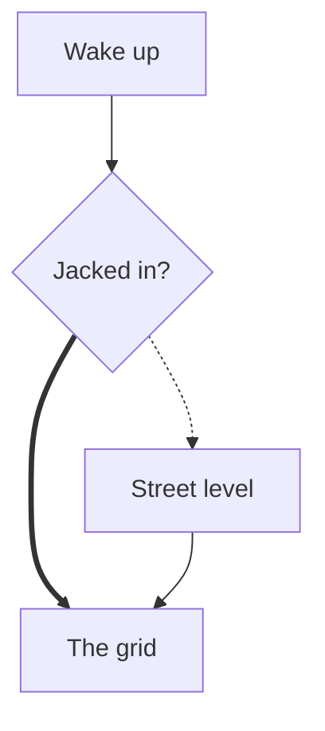
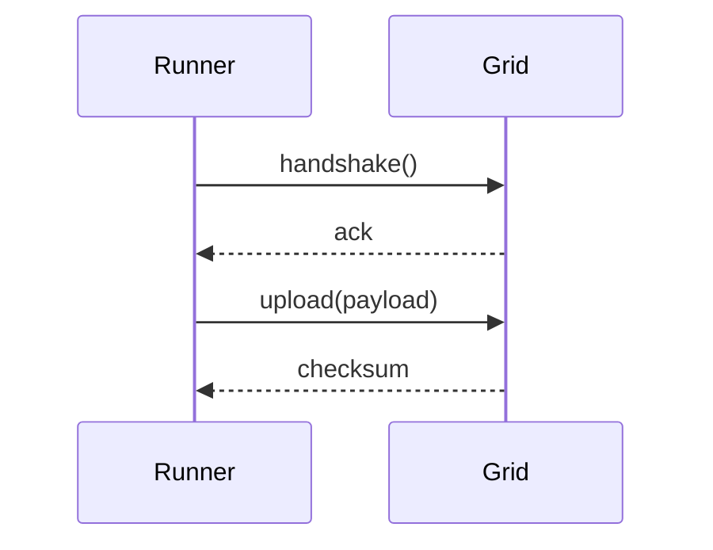

# Markdown Torture Test (h1)

Every element below must be legible in the raw buffer *and* in `Markdown: Open Preview`.
Mermaid diagrams additionally need the `bierner.markdown-mermaid` extension.

## Inline styles (h2)

**Bold text**, *italic text*, ~~strikethrough text~~, ***bold italic***, and
`inline code with a --> arrow inside`.

### Lists (h3)

1. First ordered item
2. Second ordered item
   1. Nested ordered item
3. Third ordered item

- Unordered item
- Another item
  - Nested unordered item
    - Deeper still

- [x] Completed task
- [ ] Open task
- [ ] Another open task

#### Table, aligned (h4)

| Left aligned | Centered | Right aligned |
|:-------------|:--------:|--------------:|
| cyan         | magenta  |        orange |
| `#0abdc6`    | `#ea00d9`|     `#f57800` |
| foreground   | keywords |       strings |

> A blockquote about neon cities.
> > Nested: the rain never stops in the sprawl.

---

## Code

Inline: `let neon = 0x0abdc6;` and a [link to the palette](https://github.com/Roboron3042/Cyberpunk-Neon)
plus an autolink <https://code.visualstudio.com> and a footnote.[^1]

```rust
/// Fenced Rust: tokens here also style the preview's code blocks.
fn ratio(fg: u32, bg: u32) -> f64 {
    let delta = (fg as f64) - (bg as f64);
    delta.abs() / 255.0
}
```

```python
# Fenced Python
def glow(level: int = 11) -> str:
    return f"neon-{level:02d}\n"
```

```json
{
  "name": "Cyberpunk Neon",
  "opaque": true,
  "floors": [4.5, 3.0],
  "publisher": null
}
```

## Mermaid





[^1]: Footnotes render in the preview via the footnote syntax; in the raw
    buffer this line is a link-reference-like construct.
